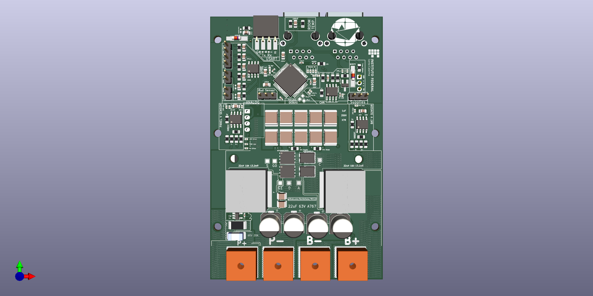
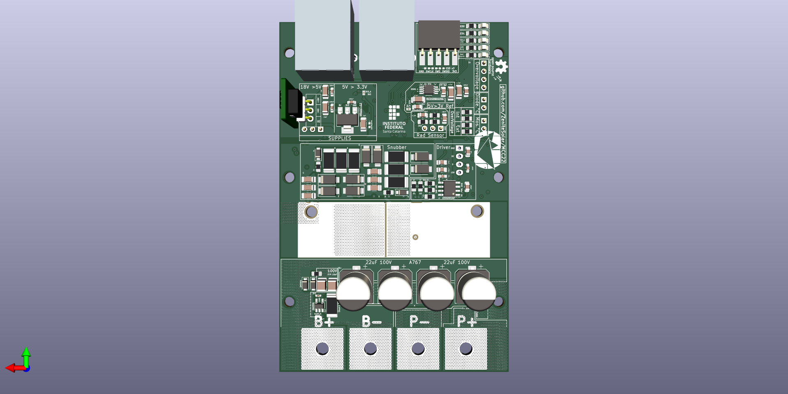
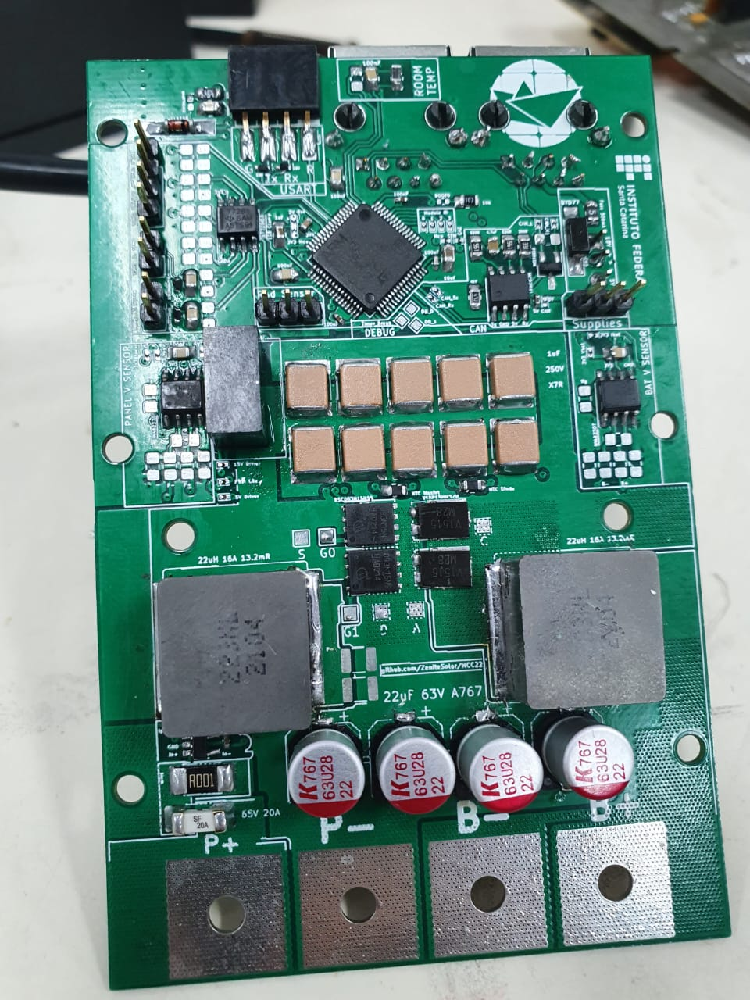
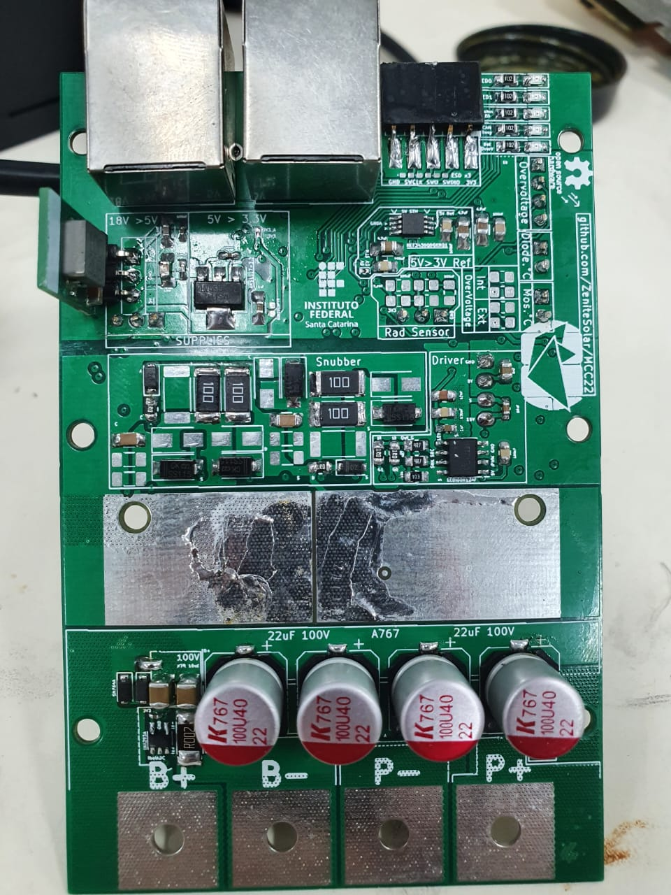

# MCC22

MPPT Battery charger

| Input Voltage     | 0 ~ 30 V  |
| ----------------: | :-------- |
|   Output Voltage  | 21 ~ 60V  |
| Output Power      | 300 W     |
| Efficiency        | > 90%     |

## 3D Model

## Soldered board

# Testing Guide for the MCC22 Board

Follow the steps below, if any value differs from the expected, abort the test. Power off and on after each step. Always limit the power source to 18V at 100mA. Use this [link](https://htmlpreview.github.io/?https://github.com/ZeniteSolar/MCC22/blob/main/hardware/main/bom/ibom.html) to find components on the board.

## Steps

1. Without any jumpers, connect the CAN with 18V, consumption should be approximately 1mA. On the power pin header (J601) there should be 5V and 3.3V at their respective pins.
2. Connect the STM 3.3V Enable jumper (JP101), consumption should be approximately 1mA.
3. Connect the STM32 Supply Enable jumper (JP201), consumption should be approximately 5mA. There should be 3.3V between the pins of capacitors C208 and C210.
4. Connect the STM 5V Enable jumper (JP103), consumption should be approximately 5mA. There should be 3V across the pins of capacitor C204.
5. Connect the Analog_Ref jumper (JP203) between the central pin and 3V_ref, consumption should be approximately 30mA. There should be 3V across the pins of capacitor C211.
6. Flash the STM32 (power should be on). When power is cycled, all LEDs should light up in sequence, excluding the Bat OverV LED. There should be a PWM signal on pin 1 of the PWM Enable jumper (JP106).
7. Connect the Enable_Analog jumper (JP102), the consumption should be approximately 5mA.
8. Connect a serial-USB converter and send the command `WRTE:SYST:PING?` to verify if UART is functioning, the response should be `PONG`.
9. Send the command `READ:MEAS:ALLM?`. After activating this flag, the board will continuously send the measurements it takes.
10. Connect a 10 Ohm resistor at the controller's output.
11. Send the command `WRTE:CTRL:ALGO:FIXD:0000.0000` to deactivate the PWM.
12. Connect the Disable_Vpanel jumper (JP301), the consumption should remain close to 5mA.
13. Connect the Disable_Vbat jumper (JP302), the consumption should remain close to 5mA.
14. Connect the Disable_Ibat jumper (JP304), the consumption should remain close to 5mA.
15. Connect the Disable_Ipanel jumper (JP303), the consumption should remain close to 5mA.
16. Connect a voltage source at P+ and P- with zero voltage and current at 10mA, increase the voltage to 30V and the VPan value on UART should follow the source voltage.
17. Connect a voltage source at B+ and B- with zero voltage and current at 10mA, increase the voltage to 60V and the Vbat value on UART should follow the source voltage.
18. Connect the Enable_Driver jumper (JP104) and consumption should be approximately 10mA. There should be 15V between pins 3 and 4 of the driver source (PS501).
19. Connect the Enable_Driver_5V jumper (JP502), Enable_Driver jumper (JP501), and Enable_PWM jumper (JP106), and the consumption should be approximately 12mA.
20. Send the command `WRTE:CTRL:ALGO:FIXD:0000.6000` to fix the PWM at 60%. Attach the oscilloscope's GND to test point S (TP404) **Other channels should have their GND disconnected!** and channel 1 to test point G0 (TP401). There should appear a square signal with a 60% duty cycle, same for G1 (TP402).
21. Connect a 10 Ohm load at the controller's output. Send the command `WRTE:CTRL:ALGO:FIXD:0000.6000`, connect a voltage source at P+ and P- with zero voltage and current at 1A, increase the voltage until the source limits and the Ipan value on UART should follow the source current.

Note: If any of the conditions are not met, there might be a potential issue with the board.

## Tests

All tests are in [this](./tests/tests.md) separated document.
