### 1 Initial Test
The initial test of the system revealed that the inductor current was operating in a discontinuous mode, which resulted in poor efficiency and a significant amount of heat being generated in both the inductor and switches. After further analysis, two primary factors were identified.
- The first factor is the high ripple current in the inductor, which is causing increased core losses. 
- The second factor is the overly aggressive snubber, which is causing switching delays and high power dissipation in the snubber.

To explore the effects of different parameters on the system's performance, two tests were conducted using different switching frequencies of 40kHz and 100kHz. The duty cycle and load were varied to maintain a constant output voltage of 60V and input current levels of 3A and 6A. These tests were designed to identify the impact of these parameters on the system's efficiency, thermal behavior, and overall performance.

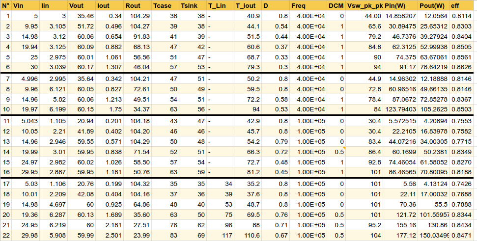

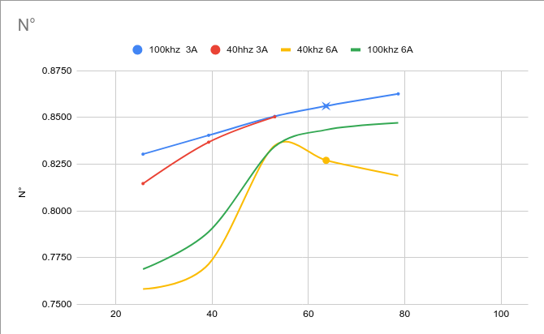

### 2 Testing inductors

During the testing of the converter, it was observed that the inductor temperature exceeded 100º and it was in discontinuous mode. Was identified as the primary suspect for this issue the low inductance value of the current inductor, which was 100uH less than the previous design.

A test was conducted to compare the performance of the current inductor (22uH) comparing with the previous inductor (120uH). The test was performed under the same operating conditions with almost the same input power and output voltage.

**Inductor Current**
- Yellow: output inductor current.
- Blue: input inductor current.

<table>
    <tr>
        <td align="center">22uH</td>
        <td align="center">120uH</td>
    </tr>
    <tr>
        <td>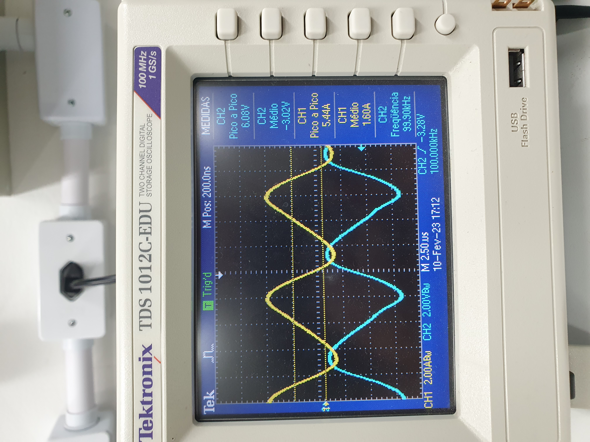</td>
        <td>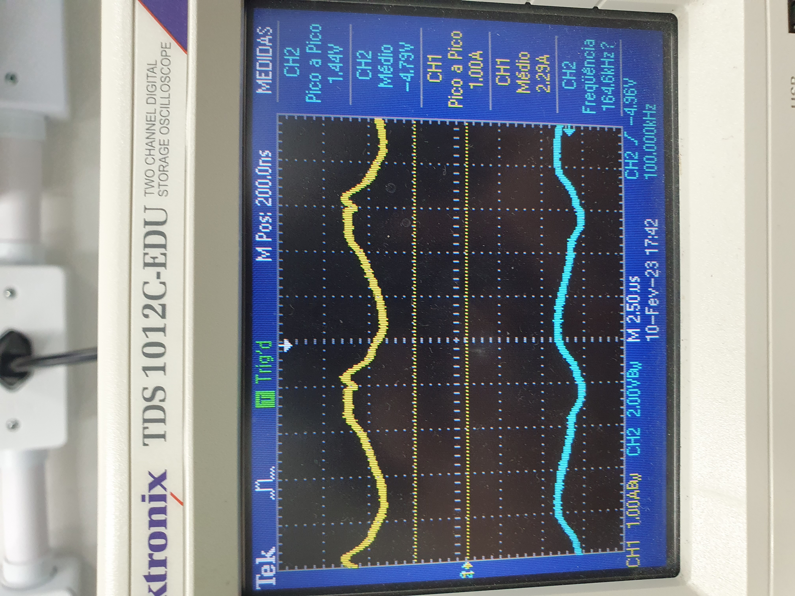</td>
    </tr>
</table> 

**Switches Voltage**
- Yellow: Mosfet.
- Blue: Diode.

<table>
    <tr>
        <td align="center">22uH</td>
        <td align="center">120uH</td>
    </tr>
    <tr>
        <td>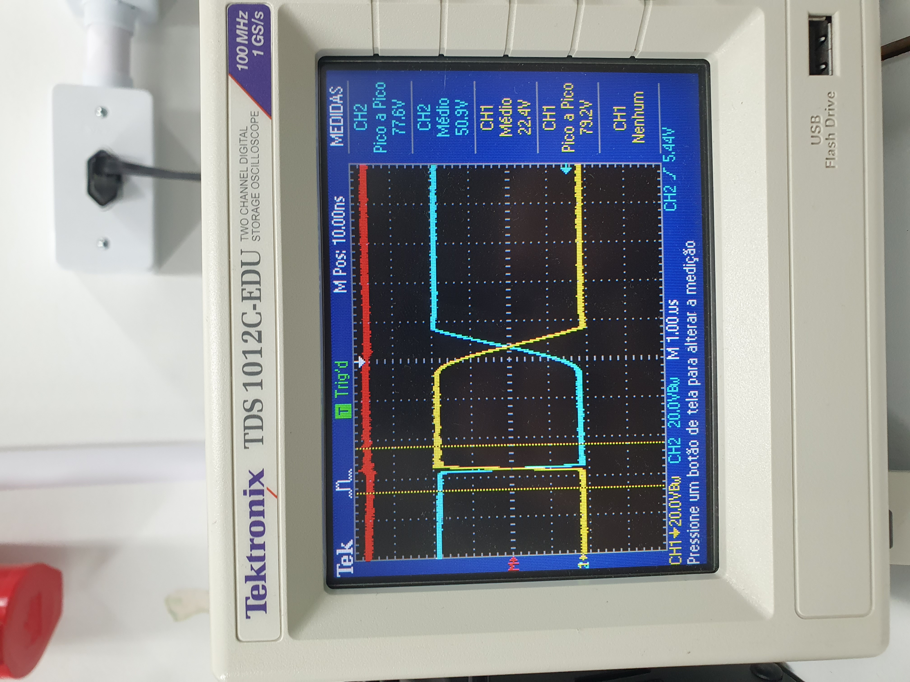</td>
        <td>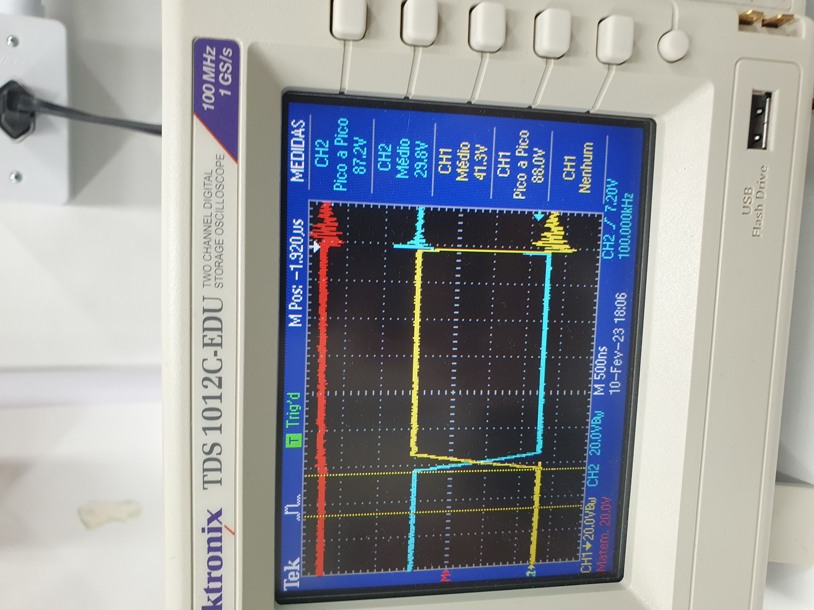</td>
    </tr>
</table> 

After changing the inductor, it was observed that the converter's efficiency improved, although it did not meet the target efficiency of >90%. Increasing the operating frequency (above 100khz), reduced the inductor temperature. However, the temperature in the coupling capacitor area increased significantly, and the root cause of this issue could be attributed to either the coupling capacitor or the snubber.

### 3 Testing snubber losses

It was observed that as the frequency was increased, the temperature in the coupling capacitor and snubber area also increased. Despite this, the switches waveform remained smooth. To further investigate this phenomenon, the snubber was disconnected and the converter was subjected to a frequency range of 200kHz to 400kHz, using the 22uH inductor.

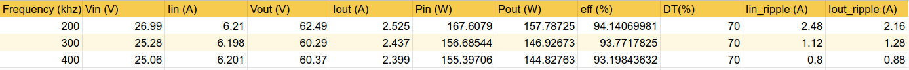

**Inductor Current**
- Yellow: output inductor current.
- Blue: input inductor current.

<table>
    <tr>
        <td align="center">200khz</td>
        <td align="center">300khz</td>
        <td align="center">400khz</td>
    </tr>
    <tr>
        <td>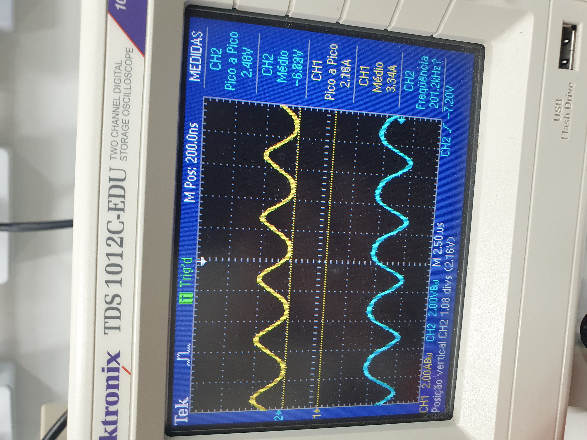</td>
        <td>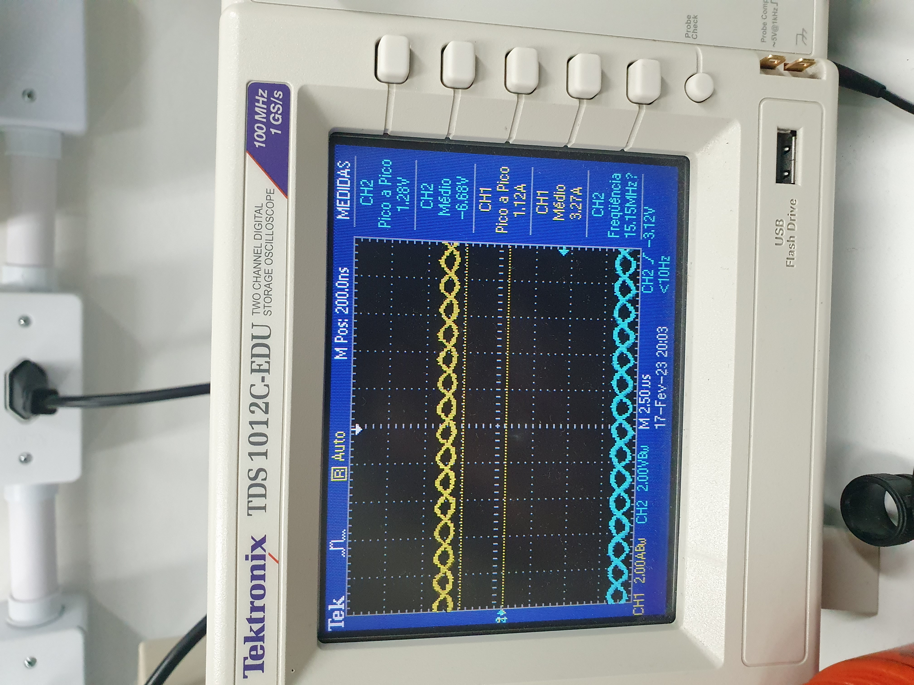</td>
        <td>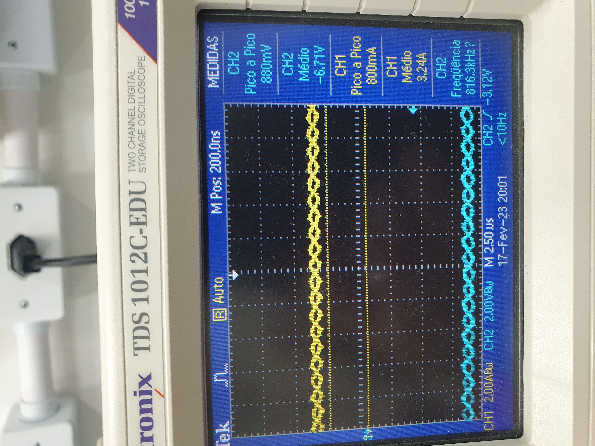</td>
    </tr>
</table> 

**Switch Voltage**
- Yellow: Mosfet.
- Blue: Diode.

<table>
    <tr>
        <td align="center">200khz</td>
        <td align="center">300khz</td>
        <td align="center">400khz</td>
    </tr>
    <tr>
        <td>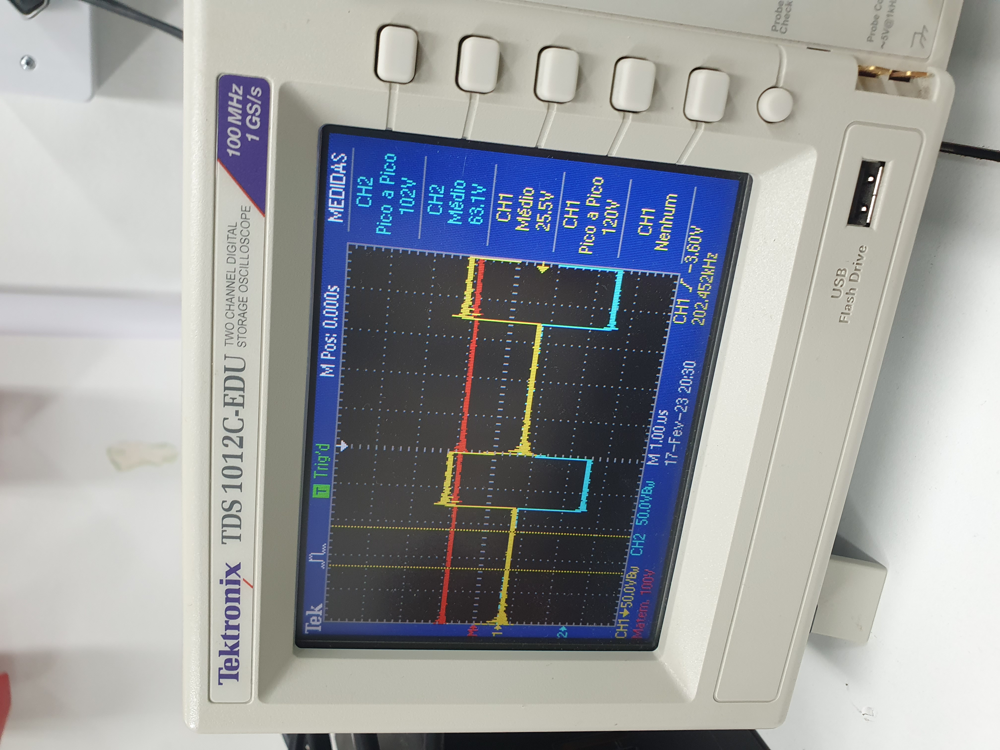</td>
        <td>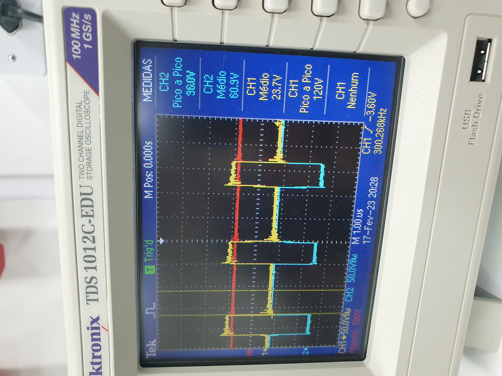</td>
        <td>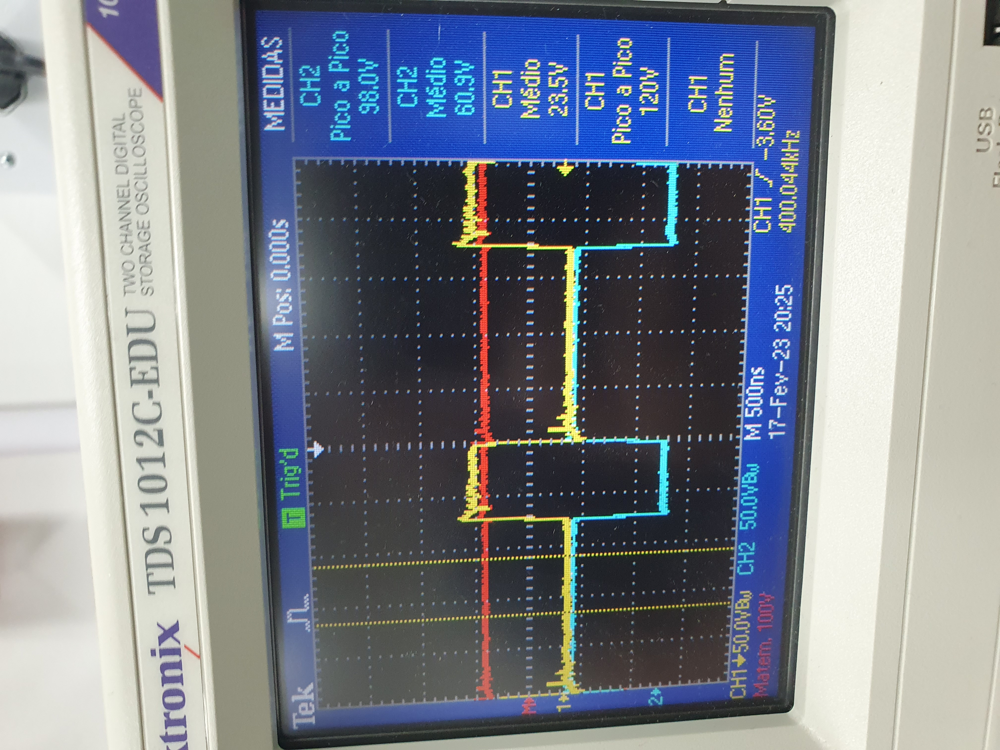</td>
    </tr>
</table> 

It was concluded that the snubber was responsible for the majority of losses, and the parasitic inductance was found to be quite low, because that the MOSFET voltage did not exceed 120V when the snubber was disconnected.